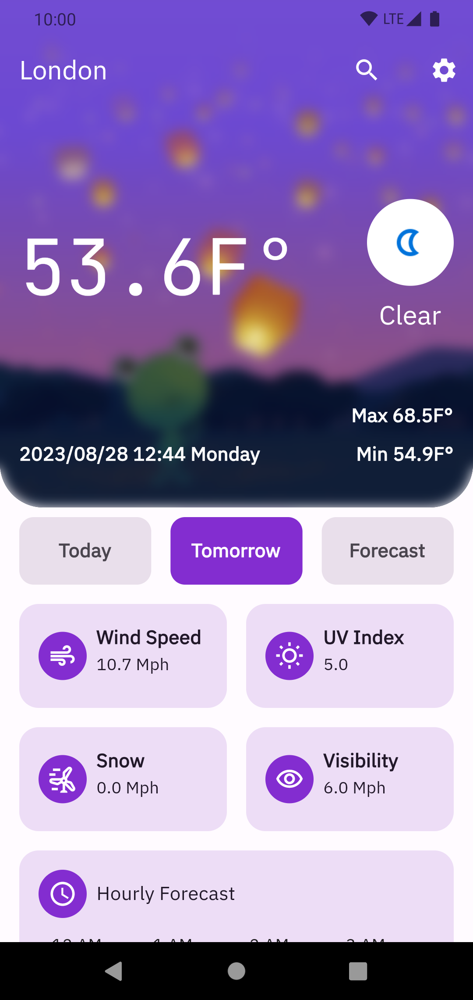

<p align="center">
  
</p>

### The Weather App
- Please the TODO.md file for task details
- The project now only tested on Android


### Features
- Riverpod for state management
- Retrofit built on Dio for network calls
- Shared preferences for data persistence
- flutter_localization for localization
- flutter_gen for assets safe access
- auto_router for navigation instead of using go_router because of safe args and type safety
- hooks for syntax sugar and less boilerplate of value notifier
- gap for spacing
- freezed, json_serializable for schema and serialization

## Requirements
- To run the app on Android just run the following command in the root directory of the project:
```
flutter run
```
- or to build
```
flutter build apk
```

## Extra bonus
- Support deep linking
  - https://weatherapp.com/today
  - https://weatherapp.com/towomorrow
  - https://weatherapp.com/forecast
  - https://weatherapp.com/settings

- lazy loading for the font assets from Google fonts

- localization
  - English
  - Arabic
Change the Android app icon, app Name


# screenshots
___
|                    |                                                             |
| :----------------: | :---------------------------------------------------------: |
| forecast-collapsed |  |
|   forecast-dark    |       |
|      forecast      |            |
|       search       |              |
|      settings      |            |
|   today-celsius    |       |
|    today-loadin    |        |
|       today        |               |
|      tomorrow      |            |
